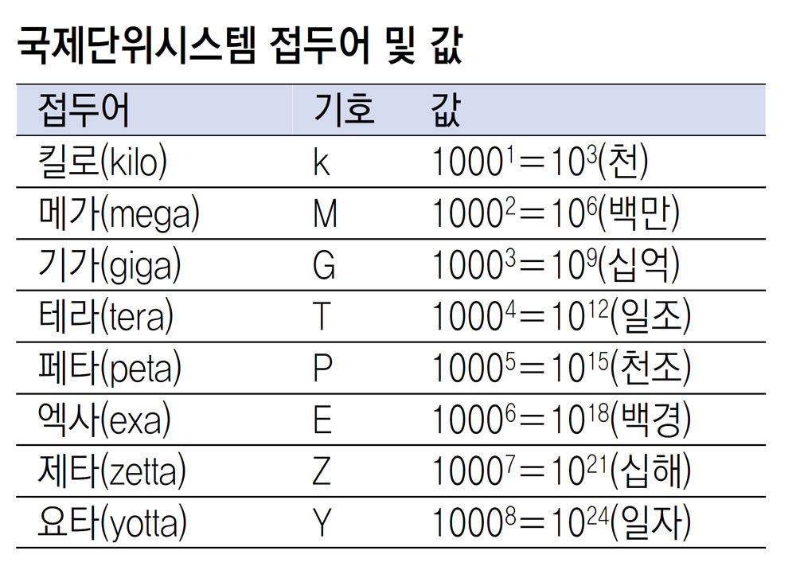
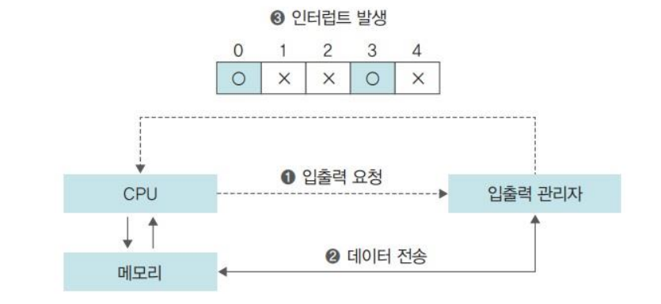
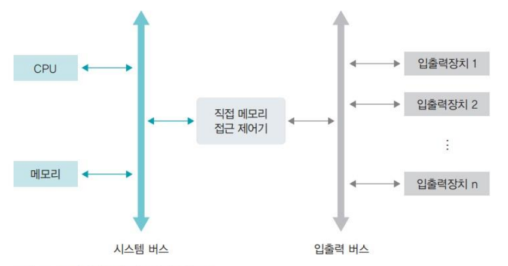
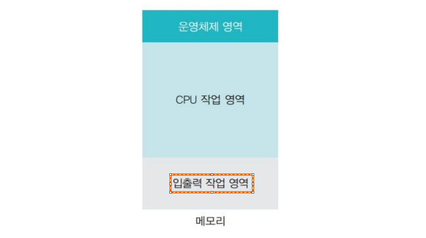

# 컴퓨터의 구조와 성능 향상

## 01. 컴퓨터의 기본 구성

### 1. 하드웨어 구성
- 필수장치 
    -  중앙처리장치, 메인메모리
- 주변장치
    - 입력장치 : 키보드, 마우스
    - 출력장치 : 프린터, 모니터, 스피커
    - 저장장치
        - 자성을 이용 : 카세트테이프, 플로피디스크, 하드디스크
        - 레이저를 이용 : CD, DVD, 블루레이디스크
        - 메모리를 이용 : USB, SD카드, CF카드, SSD
- 메인보드
### 2. 폰노이만 구조
- 이전 : 전선을 연결하여 회로를 구성하는 하드와이어링 형태
- 메모리를 이용하여 프로그래밍이 가능한 컴퓨터 구조
>모든 프로그램은 메모리에 올라와야 실행할 수 있다.
### 3. 운영체제의 작업(요리사 모형)
- 프로세스 관리 : 요리 방법 결정
- 메모리 관리 : 도마 정리
- 보관 창고 정리 : 저장장치 관리
### 4. 기초 용어 정리
- 크기단위

- 클록과 헤르츠
    - 클록 : 컴퓨터에서 일정한 박자
    - 헤르츠 : CPU 성능을 나타내는 단위
    (1초 동안 몇번의 작업이 이루어져서 몇번의 펄스(크록 틱)가 발생하는지)
- 시스템 버스와 CPU 버스
    - 시스템 버스(FSB 혹은 전면 버스) : 메모리와 주변장치를 연결하는 버스이며 메인보드의 동작 속도를 의미
    - CPU 내부 버스(BSB 혹은 후면 버스) : 시스템 버스(FSB)보다 훨씬 빠르다.
- 프로그래밍과 언어
    컴퓨터에 알려줄 작업을 하나로 모으면 **프로그램**이 된다.
    - 프로그래밍 언어 : 기계어, 어셈블리어, C, C++, 자바, 파이썬 등
        > 컴퓨터가 이해할 수 있는 언어는 기계어 뿐이다
        - 저급 언어 : 어셈블리어
        - 고급 언어 : 기계어, 어셈블리어 제외 모든 언어
        > 컴파일 : 고급언어를 기계어로 번역하는 과정
        > 인터프리터 : 소스코드를 한 번에 한 문장씩 번역하는 다른 방법
        > 인터프리터의 대표적인 언어로 자바 스크립트가 존재

## 02. CPU와 메모리

### 1. CPU의 구성과 동작
- CPU의 기본 구성
    - 산술논리 연산장치(요리)
    - 제어장치(작업지시)
    - 레지스터(재료 임시보관)
- CPU의 명령어 처리 과정

- 레지스터의 종류
    - 사용자 가시 레지스터(사용자 프로그램에 의해 변경)
        - 데이터 레지스터(DR, 범용,일반 레지스터) : 메모리에서 가져온 데이터를 임시로 보관, 대부분의 레지스터가 데이터 레지스터
        - 주소 레지스터(AR) : 데이터 또는 명령어가 저장된 메모리의 주소를 저장
    - 특수 레지스터(사용자가 임의로 변경할 수 없음)
        - 프로그램 카운터(PC, 명령어 포인터) : 다음 실행할 명령어의 주소를 가리킴
        - 명령어 레지스터(IR) : 현재 실행 중인 명령어를 저장
        - 메모리 주소 레지스터(MAR) : 메모리에서 데이터를 가져오거나 반대로 메모리로 데이터를 보낼 때 주소를 지정하는데 사용
        - 메모리 버퍼 레지스터(MBR) : 메모리에서 가져온 데이터나 메모리로 옮겨 갈 데이터를 임시로 저장
        - 프로그램 상태 레지스터(PSR) : 연산 결과(양수, 음수 등)를 저장
- 버스의 종류
    CPU와 메모리, 주변장치 간에 데이터를 주고 받을 때는 시스템버스(FSB)를 사용
    - 제어 버스
        - **제어 장치와 연결**된 버스로, CPU가 메모리와 주변장치에 제어 신로를 보내기 위해 사용
        - 메모리와 주변장치에서도 작업이 완료되거나 오류가 발생하면 제어 신호를 보내기 때문에 **양방향**
    - 주소 버스
        - **메모리 주소 레지스터와 연결**된 버스
        - 데이터를 읽거나 쓸 때 메모리나 주변장치에 위치 정보를 보내기 위해 사용, **단방향**
    - 데이터 버스
        - **메모리 버퍼 레지스터와 연결**된 버스
        - 데이터의 이동이 **양방향**
- CPU 비트의 의미
    - 버스의 대역폭은 한 번에 전달할 수 있는 데이터의 최대 크기(왕복 4차선 도로)
    - 흔히 32bit CPU, 64bit CPU라고한다.

### 2. 메모리의 종류와 부팅
- 메모리의 종류
    - RAM(Random Access Memory) : 읽기 쓰기 가능
        - 휘발성 메모리 : DRAM(Dynami RAM), SRAM(Static RAM), SDRAM(Synchronous Dynamic RAM)
        - 비휘발성 메모리 : 플래시 메모리, FRAM(Ferroelectric RAM), PRAM(Phase change RAM)
    - ROM(Read Only Memory) : 읽기만 가능
        - 마스크 롬 : 데이터를 지우거나 쓸 수 없음
        - PROM(Programmable ROM) : 전용 기계를 이용하여 데이터를 한번만 저장
        - ERPROM(Erasable Programmable ROM) : 데이터를 여러 번 쓰고 지울 수 있음
- 메모리 보호
    1. 경계 레지스터
        - CPU가 현재 진행중인 작업의 메모리 시작 주소를 저장
    2. CPU 작업
    3. 한계 레지스터
        - 현재 진행 중인 작업이 차지하고 있는 메모리의 크기, 즉 마지막 주소까지의 차이

    
- 부팅
    - 컴퓨터를 켰을 때 운영체제를 메모리에 올리는 과정
        1. 컴퓨터 전원
        2. ROM에 저장된 바이오스 실행
            1. 하드웨어 점검
            2. 하드디스크의 마스터 부트 레코드에 저장된 작은 프로그램을 메모리로 가져와 실행
        3. 부트스트랩 코드는 하드디스크에 저장된 운영체제를 메모리로 가져와 실행

## 03. 컴퓨터 성능 향상 기술

### 1. 버퍼
- 버퍼(Buffer)
    - 두 장치 사이의 속도 차이를 완화하는 역할
    - 일정량의 데이터를 모아서 옮겨 속도 차이를 완화하는 장치
        - 하드디스크 사양 1TB, 7200rpm, 256MB
            - 용량 : 1TB
            - 디스크 회전 속도 : 7500rpm
            - 버퍼 용량 : 256MB
- 스풀(SPOOL : Simultaneous Peripheral Operation On-Line)
    - CPU와 입출력장치가 독립적으로 동작하도록 고안된 소프트웨어적인 버퍼
    - 대표적인 예로 프린터에 사용되는 스풀러(spooler)
- 캐시
    - 메모리와 CPU간의 속도 차이를 완화하기 위해 메모리의 데이터를 미리 가져와 저장해 두는 임시 장소
    - 캐시 히트 : 캐시에서 원하는 데이터를 찾았을때
    - 캐시 미스 : 캐시에 원하는 데이터가 없을때
    - 일반적인 컴퓨터의 캐시 적중률은 약 90%
    - 캐시에 있는 데이터가 변경되면 반영하는 방식
        - 즉시 쓰기(write through) : 캐시에 있는 데이터가 변경되면 이를 즉시 메모리에 반영하는 방식
            - 메모리와의 빈번한 데이터 전송으로 성능이 느려진다는 단점
            - 메모리의 최신값이 항상 유지되기 때문에 급작스런 정전에도 데이터를 잃어버리지 않는다.
        - 지연쓰기(write back), 카피백 : 캐시에 있는 데이터가 변경되면 그 내용을 모아서 주기적으로 반영하는 방식
            - 메모리와의 데이터 전송 횟수가 줄어들어 시스템 성능을 향상
            - 메모리와 캐시된 데이터 사이의 불일치가 발생할 수 있음.
    - 레벨별 캐시
        - L1
            - 명령어 캐시 : 명령어 레지스터와 연결
            - 데이터 캐시 : 데이터 레지스터와 연결
        - L2
            - 일반 캐시 : 메모리와 연결

### 2. 저장장치의 계층 구조
- CPU와 가까운 쪽에 레지스터나 캐시를 배치하여 CPU가 작업을 빨리 진행할 수 있게 한다.
- 또한 메모리에서 작업한 내용을 하드디스크와 같이 저렴하고 용량이 큰 저장장치에 저장할 수 있게 한다.
- 데이터의 일관성을 유지하는것이 문제이다.
    - 메모리 지연 쓰기, 협업 중인 다른 작업의 데이터 읽기, 전원off 등

### 3. 인터럽트
- 개념
    - 요리사 옆에 주방 보조를 두는것
    - CPU의 작업과 저장장치의 데이터 이동을 독립적으로 운영
- 인터럽트 방식의 동작 과정
    1. CPU가 입출력 관리자에게 입출력 명령을 보낸다.
    2. 입출력 관리자는 명령받은 데이터를 메모리에 가져다 놓거나 메모리에 있는 데이터를 저장장치로 옮긴다.
    3. 데이터 전송이 완료되면 입출력 관리자는 CPU에 완료 신호를 보낸다.
    

### 4. 직접 메모리 접근
- 입출력 관리자가 CPU 허락없이 메모리에 접근 할 수 있는 권한
- 기본적으로 메모리는 CPU만 접근 권한을 가진 작업 공간이지만, 입출력 관리자는 허용

### 5. 메모리 맵 입출력
- 메모리의 일정 공간을 입출력에 할당하는 기법

### 6. 사이클 훔치기
- CPU와 직접 메모리 접근이 동시에 메모리에 접근할때, CPU가 메모리 사용 권한을 양보
    - CPU 작업 속도보다 입출력 장치의 속도가 느리기 때문

## 04. 멀티 프로세싱

### 1. 멀티코어 시스템
- 멀티 프로세서 시스템
    - 프로세서를 여러 개 설치하여 사용
    - 프로세서마다 레지스터와 캐시를 가지며, 모든 프로세서가 시스템 버스를 통해 메인 메모리를 공유
- 멀티 코어 시스템
    - 하나의 칩에 CPU의 핵심이 되는 코어를 여러개 만들어 여러 작업을 동시에 처리

### 2. CPU 멀티스레드
- 명령어 병렬 처리
    - 하나의 코어에서 2개 이상의 명령어를 처리하는 방법
- CPU 멀티스레드
    - 하나의 코어에 여러 개의 스레드를 동시에 처리