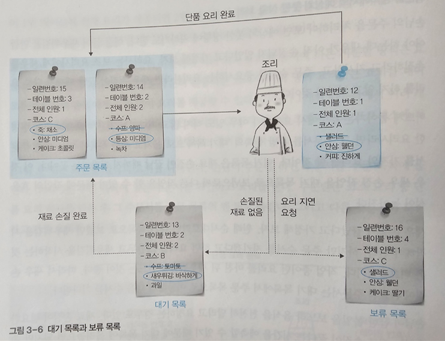
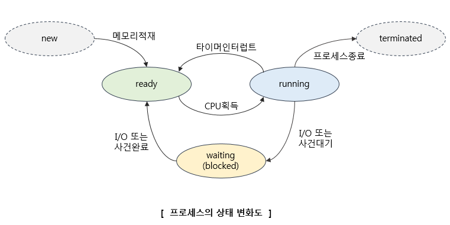
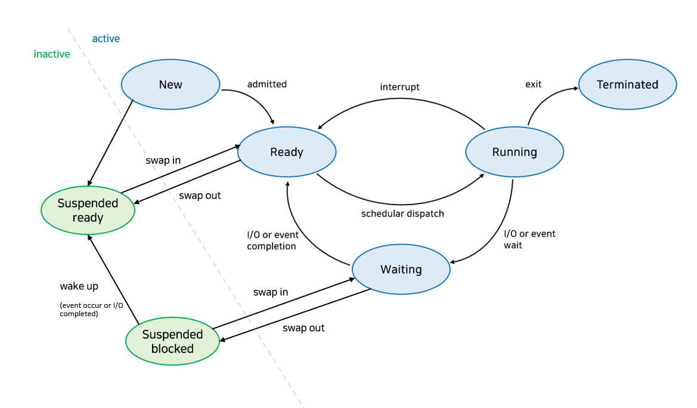
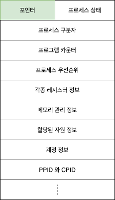
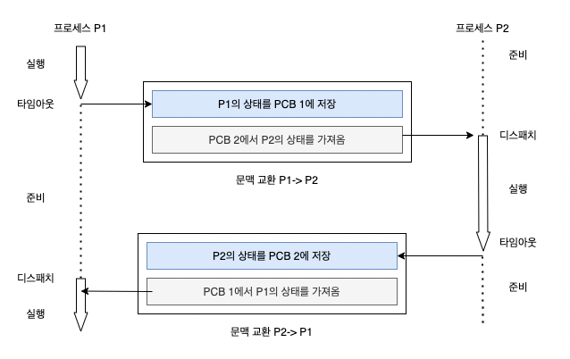
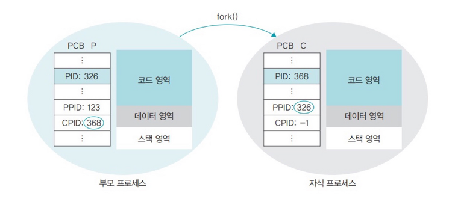
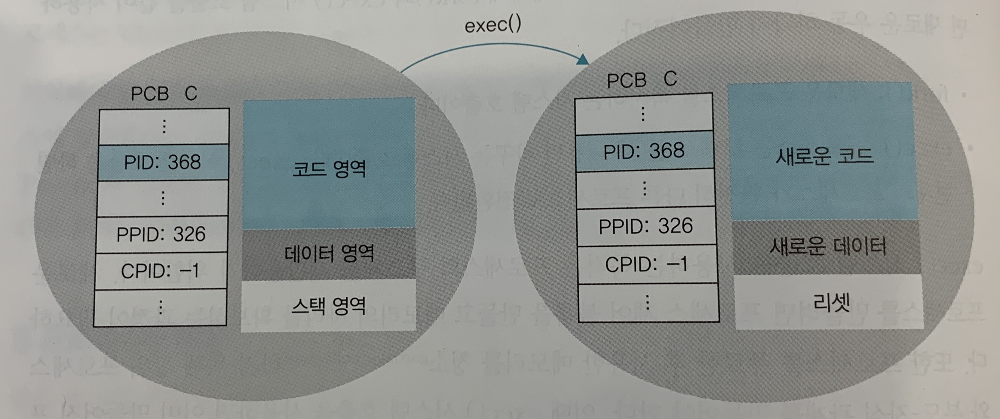
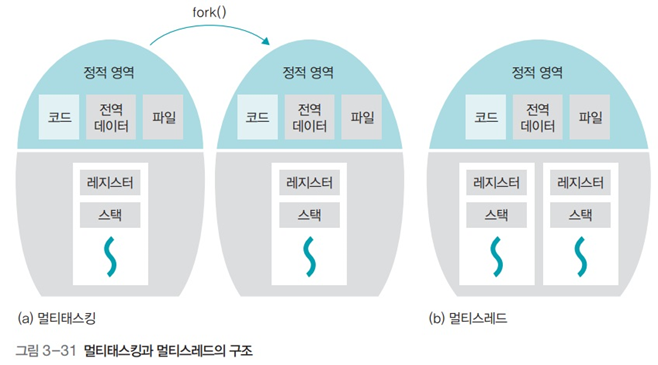

# 프로세스와 스레드

## 01 프로세스의 개요
1. 프로세스의 개념
    - 프로그램(레시피) : 저장장치에 저장된 정적인 상태
    - 프로세스(요리) : 실행을 위해 메모리에 올라온 동적인 상태
2. 요리사 모형의 비유
    - 시분할 방식의 예상치 못한 상황 처리
        
3. 프로그램에서 프로세스로의 전환
    - 프로세스 제어 블록 : 운영체제가 해당 프로세스를 실행하기 위해 관리하는 데이터구조이므로 운영체제 영역에 만들어 진다.
    - 프로세스 제어 블록의 대표적인 정보 세가지
        1. 프로세스 구분자
        2. 메모리 관련 정보
            - 프로세스의 메모리 위치 정보
            - 메모리 보호를 위한 경계 레지스터와 한계 레지스터
        3. 각종 중간값
            - 다음에 작업해야 할 코드의 위치가 담긴 **프로그램 카운터** 저장
            - 작업의 중간값을 보관 중인 다른 레지스터도 같이 저장
    > 프로세스 = 프로그램 + 프로세스 제어 블록
4. 프로세스의 상태
    - 프로세스의 네 가지 상태
        - 생성 상태
            - 프로세스가 메모리에 왈라와 실행 준비를 완료한 상태
            - 프로세스 제어 블록이 생성
        - 준비 상태
            - 생성된 프로세스가 CPU를 얻을 때까지 기다리는 상태
        - 실행 상태
            - 준비 상태에 있는 프로세스가 CPU를 얻어 실제 작업을 수행하는 상태
            - 주어진 시간에 작업이 끝나지 않으면 준비상태로 돌아가 다음 차례를 기다림.
        - 완료 상태
            - 실행 상태의 프로세스가 주어진 시간 동안 작업을 마치면 완료 상태
            - 프로세스 제어 블록이 사라진 상태
    >- CPU 스케줄러
        - 준비 상태에 있는 여러 프로세스 중 다음에 실행할 프로세스를 선정하는 일을 담당
    >- 디스패치
        - 준비 상태의 프로세스 중 하나를 골라 실행 상태로 바꾸는 CPU 스케줄러의 작업
    >- 타임아웃
        - 프로세스는 자신에게 주어진 하나의 타임 슬라이스 동안 작업을 끝내지 못하면 다시 준비 상태로 돌아감
    - 프로세스의 다섯 가지 상태
        - `생성`, `준비`, `실행`, `대기`, `완료` 상태
    
    - 휴식 상태
        - 사용하던 데이터가 메모리에 그대로 있고 프로세스 제어 블록도 유지
    - 보류 상태
        - 메모리에서 잠시 쫒겨난 상태
        - 일시 정지 상태
        

## 02 프로세스 제어 블록과 문맥 교환
1. 프로세스 제어 블록
    - 구성
        
2. 문맥 교환
    - 문맥 교환의 의미
        - CPU를 차지하던 프로세스가 나가고 새로운 프로세스를 받아 들이는 작업
        - 실행 상태에서 나가는 프로세스 제어블록에는 지금까지의 작업 내용을 저장
        - 실행 상태로 들어오는 프로세스 제어블록의 내용으로 CPU가 다시 세팅
    - 문맥 교환의 절차
        
    - 문맥교환이 일어나는 경우
        - 한 프로세스가 자신에게 주어진 시간을 다 사용하면 발생
        - 인터럽트가 걸렸을 때 발생
        - 어떤 프로세스가 자신에게 주어진 메모리 공간을 넘어가려 한다면(경계 레지스터의 범위를 벗어나는 것) 인터럽트가 발생하여 현재 실행 중인 프로세스의 제어 블록을 저장한 후 인터럽트 관리 프로세스를 실행 상태로 만든다. 인터럽트 관리 프로세스는 메모리 범위를 넘어선 프로세스를 강제로 종료하고 인터럽트 처리를 마친다.
    - 문맥 교환과 타임 슬라이스의 크기
        - 타임 슬라이스는 되도록 작게 설정하되 문맥 교환에 걸리는 시간을 고려하여 적당한 크기로 설정하는 것이 중요하다.
        - 유닉스 운영체제의 타임 슬라이스 : 10~200밀리초 (대략 100밀리초)
        
## 03 프로세스의 연산
1. 프로세스의 구조
    - 코드 영역
        - 본문이 기술된 곳(텍스트 영역)
    - 데이터 영역
        - 사용 되는 변수나 파일 등의 각종 데이터
    - 스택 영역
        - 프로세스를 실행하기 위해 부수적으로 필요한 데이터를 모아놓은 곳
2. 프로세스의 생성과 복사
    - fork() 시스템 호출의 개념
        - fork() 시스템 호출은 실행 중인 프로세스를 복사하는 함수
        - 부모-자식 관계
            - 실행하던 프로세스는 부모 프로세스
            - 새로 생긴 프로세스는 자식 프로세스
    - fork() 시스템 호출의 동작 과정
        
    - fork() 시스템 호출의 장점
        - 프로세스의 생성 속도가 빠르다
        - 추가 작업 없이 자원을 상속할 수 있다
        - 시스템 관리를 효율적으로 할 수 있다
3. 프로세스의 전환
    - exec() 시스템 호출의 개념
        - exec() 시스템 호출은 이미 만들어진 프로세스의 구조를 재활용하는 것
        - 프로세스 제어 블록, 메모리 영역, 부모-자식관계 등 그대로 사용
        - 코드 영역만 교체
    - exec() 시스템 호출의 동작 과정
        
4. 프로세스의 계층 구조
    - 프로세스 계층 구조의 장점
        - 여러 작업의 동시 처리
            - Login 프로세스를 fork() 시스템 호출로 여러개 만들어 여러 사용자를 동시에 처리
            - Login 프로세스 이후 Shell 프로세스가 필요해서 exec() 시스템 호출을 사용해서 자원을 효율적으로 관리(또한 기존의 부모-자식관계 유지)
        - 용이한 자원 회수
            - 프로세스 간의 책임 관계가 분명해져서 시스템을 관리하기가 수월
            - 모든 프로세스가 독립적이면 프로세스 종료시 운영체제가 자원을 회수
            - 모든 프로세스를 부모-자식 관계로 만들면 자식 프로세스가 종료되면 사용하던 부모 프로세스가 회수
    - 고아 프로세스와 좀비 프로세스
        - 고아 프로세스
            - 자식 프로세스가 종료되기 전에 부모 프로세스가 먼저 종료되어 자식 프로세스가 남는경우
        - 좀비 프로세스
            - 자식 프로세스가 종료되었는데도 부모 프로세스가 뒤처리를 하지 않을 때 발생
        - 운영체제는 주기적으로 반환되지 못한 자원을 회수해야한다.

## 04 스레드
1. 스레드의 개념
    - 스레드의 정의
        - 프로세스(안심 스테이크) : 운영체제 입장의 작업 단위
        - 스레드(조리) : CPU 입장의 작업 단위
    - 프로세스와 스레드의 차이
        - 프로세스 : 약한 연결
        - 스레드 : 강한 연결
        - 멀티태스크 : 서로 독립적(ex - 워드프로세서와 프린터 스풀러)
        - 멀티스레드 : 변수나 파일 등을 공유하고 전역 변수나 함수 호출 등의 방법으로 스레드 간 통신(ex - 워드프로세서 내의 문서 편집, 문서 입출력, 맞춤법 검사 등)
    - 여러개의 코어를 가진 CPU가 생겨나 멀티스레드를 지원하기 시작
    - 스레드 관련 용어
        - 멀티스레드
        - 멀티태스킹
        - 멀티 프로세싱
        - CPU 멀티스레드
2. 멀티스레드의 구조와 예
    - 멀티스레드의 구조
        
3. 멀티스레드의 장단점
    - 멀티스레드의 장점
        - 응답성 향상
        - 자원 공유
        - 효율성 향상
        - 다중 CPU 지원
    - 멀티스레드의 단점
        - 모든 스레드가 자원을 공유하기 때문에 한 스레드에 문제가 생기면 전체 프로세스에 영향을 미친다. (ex - 인터넷 익스플로러의 여러 화면 중 하나가 문제가 생기면 인터넷 익스플로러 전체가 종료된다.)
4. 멀티스레드 모델
    - 사용자 스레드(1 to N 모델)
    - 커널 스레드(1 to 1 모델)
    - 멀티레벨 스레드(M to N 모델)

## 05 동적 할당 영역과 시스템 호출
1. 프로세스의 동적 할당 영역
- 정적 할당 영역 : 코드 영역, 데이터 영역
    - 동적 할당 영역 : 힙 영역, 스택영역
    - 스택영역
        - 스레드가 작동하는 동안 추가되거나 삭제되는 동적 할당 영역
    - 힙 영역
        - 동적으로 할당되는 변수 영역(ex - malloc() free())
2. exit()와 wait() 시스템 호출
- exit() 시스템 호출
    - 부모 프로세스는 자식 프로세스가 사용하던 자원을 빨리 거둬 갈 수 있다.
    - exit(0) : 정상 종료
    - exit(-1) : 비정상 종료
- wait() 시스템 호출
    - 자식 프로세스가 끝나기를 기다리는 함수
    - 부모 프로세스가 먼저 종료됨으로써 고아 프로세스가 생기는 것을 방지